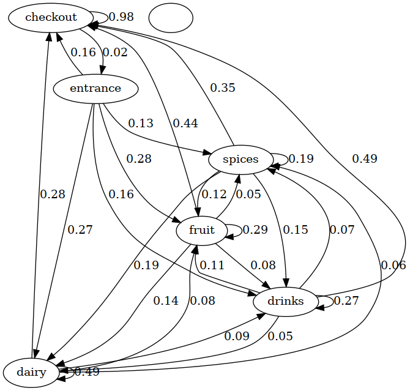

## Customers_Behaviour_Markov_Simulation

This repository contains a simulation of customer behavior in a supermarket using Markov Chain modeling.

The simulation is based on tracked data from customers in a supermarket over a five-day week. The data includes tabular information about where customers spent their time within the supermarket.

Customers start by entering through the entrance and then have the freedom to move between four different areas: fruit, spices, dairy, and drinks. Eventually, they will reach the checkout area, at which point they are considered to have left the shop.

The transition probabilities matrix is computed to examine the likelihood of customers transitioning between various sections of the supermarket.

### State Diagram

### Technologies and Libraries
- Python 3.10
- OpenCV
- pandas
- numpy

## License

- **[MIT license](http://opensource.org/licenses/mit-license.php)**

